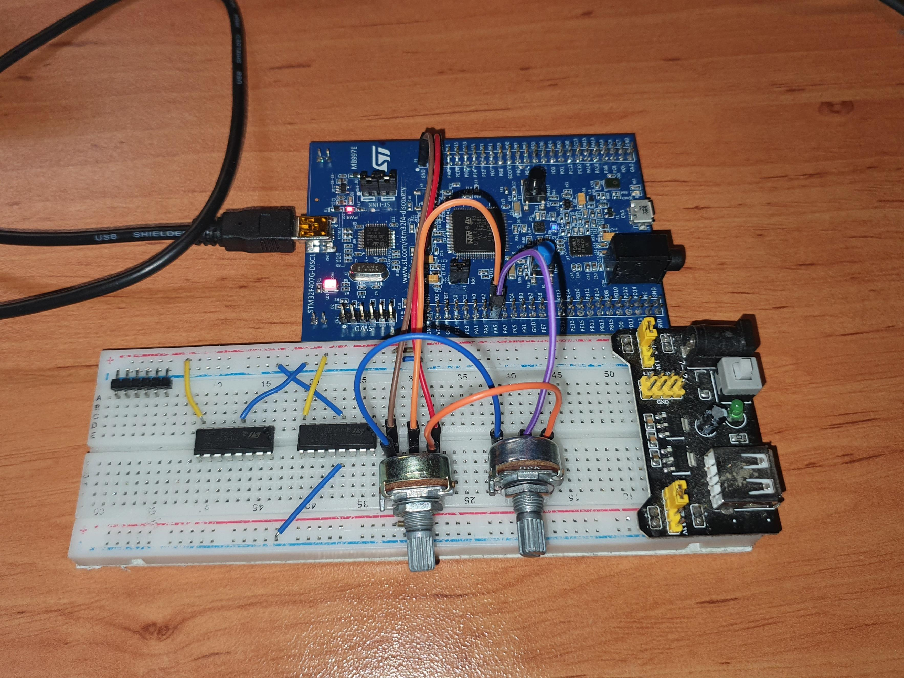

Very similar to the previous example just do 2 sequential readings, the HAL library takes care of the flags and everything just works.

We have 2 potentiometers connected to 3V, GND and PA4 and PA%

